<p align="center">
  <picture>
    <source media="(prefers-color-scheme: dark)" srcset="assets/mascot/in-sync-dark.svg">
    
  </picture>
</p>

Sluiceway keeps one GitHub issue that shows which Pulumi, OpenTofu, Terraform, Helm or Kubernetes stacks have changes waiting, and deploys a stack when you tick its box. Nothing deploys unless a person asks, or unless your own `sluiceway.yaml` says a stack goes out on merge.

> [!IMPORTANT]
> **Sluiceway is in beta.** It is released as [0.x](https://github.com/sluiceway/sluiceway/releases), and the [roadmap](https://docs.sluiceway.dev/roadmap/) says what comes before 1.0. Use `sluiceway/sluiceway@v0` or [pin a commit](https://docs.sluiceway.dev/guides/workflow/#pin-a-commit), and report rough edges as [issues](https://github.com/sluiceway/sluiceway/issues/new).

## What it looks like

The dashboard is Markdown, so here is one: an example from made-up rows, rendered by Sluiceway's own code, with every section at once. In a real dashboard issue you tick its boxes; here they are disabled. The same body, as a dashboard issue holds it, is [`assets/example-dashboard.md`](assets/example-dashboard.md).

<p align="center">
  <picture>
    <source media="(prefers-color-scheme: dark)" srcset="https://raw.githubusercontent.com/sluiceway/sluiceway/v0.46.0/assets/mascot/deploying-4-deletes-replaces-dark.svg">
    
  </picture>
</p>

<div align="center">

🟡&nbsp;**4 pending** · 🟠&nbsp;2 drifted · 🔵&nbsp;2 deploying · ⚪&nbsp;0 preview failed · 🟢&nbsp;8 in sync · :warning: **2 pending stacks delete or replace resources**

Scanned [`34e410f`](https://github.com/example-org/infra/commit/34e410f2ce7bd7cfd94d9a2f1d5bc0b2dcc6aa91) on 2026-09-21 10:02 UTC · [run](https://github.com/example-org/infra/actions/runs/17034455121) · <sub>last full scan 2026-09-21 06:00 UTC</sub>

</div>

<details>
<summary><b>Open the example dashboard</b>: all 16 stacks and every section</summary>

### Deploying

- <picture><source media="(prefers-color-scheme: dark)" srcset="https://raw.githubusercontent.com/sluiceway/sluiceway/v0.46.0/assets/mascot/spinner-dark.svg"></picture> **apps/api:prod** · deploying · ticked by alice · [run](https://github.com/example-org/infra/actions/runs/17034467330)<br>
  from [#512](https://github.com/example-org/infra/pull/512) by alice · [compare](https://github.com/example-org/infra/compare/e27f50794430...34e410f2ce7b)
- <picture><source media="(prefers-color-scheme: dark)" srcset="https://raw.githubusercontent.com/sluiceway/sluiceway/v0.46.0/assets/mascot/spinner-queued-dark.svg"></picture> **apps/worker:prod** · queued behind **apps/api:prod** · ticked by alice · [run](https://github.com/example-org/infra/actions/runs/17034467330)<br>
  from [#509](https://github.com/example-org/infra/pull/509) by bob · [compare](https://github.com/example-org/infra/compare/ae93aa6a808a...34e410f2ce7b)

### Updates waiting to merge

Tick a box to merge that pull request. Its stack is then previewed again and deployed as that preview shows it.

- [ ] **platform/ingress-nginx:prod** · Update Helm release ingress-nginx to v4.13 · [#519](https://github.com/example-org/infra/pull/519) by renovate&#91;bot&#93; · preview after the merge: 1 update

These wait on their own checks. Each gets a box here once its checks are green.

- **apps/web:prod** · Update dependency next to v15.5 · [#521](https://github.com/example-org/infra/pull/521) by renovate&#91;bot&#93; · waits on its checks

### Pending

Tick a box to deploy that stack exactly as its row shows it.

> [!CAUTION]
> 2 pending stacks delete or replace resources: **apps/legacy-worker:prod**, **infra/network:prod**
>
> 1 drifted stack has resources gone outside the code: **platform/external-dns:prod**

- [ ] **apps/billing:prod** · 1 create, 1 update · [preview](https://github.com/example-org/infra/runs/48213301)<br>
  from [#514](https://github.com/example-org/infra/pull/514) by erin, [#511](https://github.com/example-org/infra/pull/511) by renovate&#91;bot&#93; · [compare](https://github.com/example-org/infra/compare/92a260fb62d8...34e410f2ce7b)
  <details><summary>2 changes</summary>
  <kbd>update</kbd> <code>kubernetes:apps/v1:Deployment</code> <b>billing</b> · <code>spec.replicas</code> <code>2</code> → <code>3</code><br>
  <kbd>create</kbd> <code>kubernetes:monitoring.coreos.com/v1:ServiceMonitor</code> <b>billing</b><br>
  </details>
- [ ] **apps/legacy-worker:prod** · **3 deletes**, 1 tracking only · [preview](https://github.com/example-org/infra/runs/48213302)<br>
  from [#498](https://github.com/example-org/infra/pull/498) by dave · [compare](https://github.com/example-org/infra/compare/461a661f5643...34e410f2ce7b)<br>
  :warning: <kbd>DELETE</kbd> <code>aws:sqs/queue:Queue</code> <b>legacy-jobs</b><br>
  :warning: <kbd>DELETE</kbd> <code>kubernetes:apps/v1:Deployment</code> <b>legacy-worker</b><br>
  :warning: <kbd>DELETE</kbd> <code>kubernetes:core/v1:Service</code> <b>legacy-worker</b>
  <details><summary>1 other change</summary>
  <kbd>forget</kbd> <code>aws:iam/role:Role</code> <b>legacy-worker</b><br>
  </details>
- [ ] **apps/web:staging** · 2 creates, 1 update · [preview](https://github.com/example-org/infra/runs/48213303)<br>
  from [#516](https://github.com/example-org/infra/pull/516) by carol, [#510](https://github.com/example-org/infra/pull/510) by bob, and 1 change outside this stack · [compare](https://github.com/example-org/infra/compare/aa6e427d334b...34e410f2ce7b)
  <details><summary>3 changes</summary>
  <kbd>update</kbd> <code>kubernetes:apps/v1:Deployment</code> <b>web</b> · <code>metadata.labels&#91;&quot;app.kubernetes.io/version&quot;&#93;</code>, <code>spec.template.spec.containers&#91;0&#93;.image</code><br>
  <kbd>create</kbd> <code>kubernetes:autoscaling/v2:HorizontalPodAutoscaler</code> <b>web</b><br>
  <kbd>create</kbd> <code>kubernetes:core/v1:ConfigMap</code> <b>web-feature-flags</b><br>
  </details>
  <details><summary>changes outside this stack</summary>
  <a href="https://github.com/example-org/infra/pull/497">#497</a> by frank<br>
  </details>
- [ ] **infra/network:prod** · 1 update, **1 replace** · [preview](https://github.com/example-org/infra/runs/48213304)<br>
  from [11fa403](https://github.com/example-org/infra/commit/11fa403908e7cf940afa4635f39fb7d8bf5f0eaa) by gina · [compare](https://github.com/example-org/infra/compare/55050087957c...34e410f2ce7b)<br>
  :warning: <kbd>REPLACE</kbd> <code>aws:ec2/subnet:Subnet</code> <b>private-b</b> · forced by <code>cidrBlock</code>
  <details><summary>1 other change</summary>
  <kbd>update</kbd> <code>aws:ec2/routeTable:RouteTable</code> <b>private</b> · <code>routes&#91;1&#93;.natGatewayId</code><br>
  </details>

- [ ] Deploy all 4 pending stacks

### Drifted

Real infrastructure changed outside the code. Deploying a stack puts it back as its code says.

- [ ] **monitoring/grafana:prod** · 1 changed outside the code · [preview](https://github.com/example-org/infra/runs/48213305)
  <details><summary>1 change outside the code</summary>
  <kbd>changed</kbd> <code>kubernetes:apps/v1:Deployment</code> <b>grafana</b> · <code>spec.replicas</code><br>
  </details>
- [ ] **platform/external-dns:prod** · 1 gone outside the code · [preview](https://github.com/example-org/infra/runs/48213306)
  <details><summary>1 change outside the code</summary>
  <kbd>gone</kbd> <code>aws:route53/record:Record</code> <b>status-cname</b><br>
  </details>

- [ ] **Confirm:** repair all 2 drifted stacks: **monitoring/grafana:prod**, **platform/external-dns:prod** · asked by carol<br>
  Ticking this deploys each stack as its row shows it, in dependency order. A change to these rows first takes it back.

### In sync

<details><summary>8 stacks in sync</summary>

- apps/api:staging
- apps/auth:prod
- apps/auth:staging
- apps/billing:staging
- apps/web:prod
- data/postgres:prod
- data/postgres:staging
- platform/ingress-nginx:prod

</details>

<details><summary>1 stack left out by ignore</summary>

- sandbox/playground:dev · a scratch stack, deployed by hand

</details>

### Recently deployed

Times are in UTC.

- 🟢&nbsp;apps/auth:prod · alice · 09-21 09:41 · [run](https://github.com/example-org/infra/actions/runs/17034388102)<br>
  shipped [#513](https://github.com/example-org/infra/pull/513) by alice · [compare](https://github.com/example-org/infra/compare/ae93aa6a808a...4a35e6dd48fe)
- 🟢&nbsp;data/postgres:prod · deployed outside the dashboard, from [`35bf0b7`](https://github.com/example-org/infra/commit/35bf0b7251cdfd47085dc72ea2ba4c6aff3b7237) · 09-21 09:30
- ⚪&nbsp;apps/auth:staging · no changes · alice · 09-21 09:12 · [run](https://github.com/example-org/infra/actions/runs/17034120455)
- 🟢&nbsp;platform/ingress-nginx:prod · drift fixed · carol · 09-20 18:05 · [run](https://github.com/example-org/infra/actions/runs/17030044170)
- 🟢&nbsp;apps/web:prod · bob · 09-20 16:52 · [run](https://github.com/example-org/infra/actions/runs/17029910331)<br>
  shipped [#510](https://github.com/example-org/infra/pull/510) by bob · [compare](https://github.com/example-org/infra/compare/ae93aa6a808a...92a260fb62d8)
- 🔴&nbsp;apps/web:prod · failed · bob · 09-20 16:40 · [run](https://github.com/example-org/infra/actions/runs/17029855012)

---

- [ ] Rescan all stacks

<sub>[Sluiceway](https://github.com/sluiceway/sluiceway) v0.46.0 · [docs](https://docs.sluiceway.dev/)</sub>

</details>

## How it works

A scan previews your stacks, and nothing deploys until someone ticks a box, unless your own `sluiceway.yaml` sets a stack to go out on merge.

1. After a merge to the default branch, and once a day, a **scan** previews the stacks in the repo.
2. The scan writes the dashboard issue: one row per stack, and a box on every stack that has changes waiting.
3. You tick a box. That asks for that stack to be deployed exactly as its row shows it.
4. Sluiceway checks that you may tick that stack, and previews it again. It deploys only if the fresh preview still matches the row.
5. The row goes back to in sync, or says why the deploy failed, with a link to the run.

The issue is a view and never the source of truth. What is pending is always worked out again from a fresh preview.

## Get started

**Check your setup.** In your clone, `npx sluiceway check` says which stacks Sluiceway finds and whether its settings are valid, and `npx sluiceway init` (or `bunx sluiceway init`) writes the workflow and a first `sluiceway.yaml` from them, and commits nothing ([start with init](https://docs.sluiceway.dev/guides/init/)). The same check runs on every pull request. It needs no credentials, no tool and no write access, so start with it before anything can deploy. Put [the check workflow](https://docs.sluiceway.dev/guides/workflow/#check-your-setup) in `.github/workflows/deploy-dashboard-check.yml` and open a pull request with it. The summary of its run lists every stack it found, with its tick rule, and which credentials each stack needs, as names, and which of them nothing in the workflow provides. To see your dashboard first with nothing that can deploy, [start read only](https://docs.sluiceway.dev/guides/read-only-trial/).

**Before the first scan.** Two red rows are the ones new users met first. A Pulumi stack config file with no stack in the backend is still a stack, and its preview fails: leave it out with [`ignore`](https://docs.sluiceway.dev/guides/configuration/#ignore) and its full stack id, `<path>:<name>`, such as `apps/web:dev`, never `apps/web`, or let the scan create the stack with `createInBackend: true` on its entry in `sluiceway.yaml`. A program that pulls from a private registry works on your laptop and fails on the runner until a step of the workflow logs in to that registry.

**Decide who may deploy.** A tick asks for a deploy of that stack, production included. Without `sluiceway.yaml`, anyone with write access to the repo can tick, and without a GitHub Environment with required reviewers on the job that deploys, a tick is enough to deploy. Decide this before the workflow reaches the default branch: make the people who may deploy the reviewers of that environment, which needs the [split workflow](https://docs.sluiceway.dev/guides/split-workflow/#with-github-environments), or narrow who may tick with a tick rule in `sluiceway.yaml` at the repo root, such as `tickers: maintain` ([who can tick](https://docs.sluiceway.dev/guides/security/#who-can-tick)). The same file leaves stacks out, names the files outside a stack's directory that it reads, and declares the stacks discovery does not find from files: Helm releases, Kubernetes manifests, and the OpenTofu and Terraform root modules that discovery leaves out. For Pulumi stacks and the root modules discovery finds, the file is optional. [Configuration](https://docs.sluiceway.dev/guides/configuration/) has every key.

**Load your credentials.** The workflow gives the tool what it needs. For GitHub secrets, put them as `env:` on Sluiceway's own step, so no other step sees them. For a cloud with OIDC or a secret manager, add a loading step right before Sluiceway's, after every install step. Sluiceway passes that environment to the tool as it is and never reads a credential by name. Or name a file of `NAME=value` lines with the `env-file` input, and Sluiceway reads it for the tool and masks every value itself. A repo whose stacks live in different places names a file per stack with `envFile` in `sluiceway.yaml`, and each stack's tool gets its own on top. [Credentials](https://docs.sluiceway.dev/guides/credentials/) has recipes for GitHub secrets, an env file, a cloud with OIDC, a secret manager and private registries.

**Add the workflow.** This is the whole loop: one job with one Sluiceway step, and no `if:` anywhere. The step reads the event of the run and does what it asks for: a push or the schedule scans, a tick deploys, an edit of any other issue ends with a notice. GitHub starts the job for an edit of any issue in the repo, so that run also installs your tools and loads your credentials before it ends, and it runs only code from the default branch. The [split workflow](https://docs.sluiceway.dev/guides/split-workflow/) keeps credentials out of the job an issue edit starts. The file goes in `.github/workflows/deploy-dashboard.yml` on the default branch, and the comments mark where your own steps go. Merge it once the steps above are in place. The push of that merge starts the first scan. A scan only previews: it writes the dashboard issue with one row per stack, and nothing deploys until someone ticks a box. [The workflow](https://docs.sluiceway.dev/guides/workflow/) explains every part, and what merge and deploy, stack dependencies, self-hosted runners and GitHub Environments add. [Example workflows](https://docs.sluiceway.dev/guides/example-workflows/) has it complete for common setups, and [init](https://docs.sluiceway.dev/guides/init/) writes a first version from what it finds in your repo.

```yaml
name: deploy-dashboard

on:
  push:
    branches: [main]
  schedule:
    - cron: "0 6 * * *" # keep this: a push previews only some stacks, this scan all
  workflow_dispatch:
  issues:
    types: [edited]

# This block is everything Sluiceway can do in your repo.
permissions:
  contents: read # check out the code
  issues: write # write the dashboard and its comments
  deployments: write # record who deployed what, and when
  actions: write # the rescan box and settle start this workflow again
  pull-requests: read # name the pull requests behind a row
  checks: write # a preview page per pending stack

jobs:
  sluiceway:
    runs-on: ubuntu-latest
    # One run at a time, and none is dropped. An edit of any other issue gets
    # a group of its own, so it never waits for a scan or a deploy.
    concurrency:
      group: sluiceway-${{ github.event.issue.number }}
      queue: max
    steps:
      - uses: actions/checkout@v7
      # This installs Pulumi. For OpenTofu, Terraform, Helm or kubectl, install
      # that tool here instead (see Requirements).
      - uses: pulumi/actions@v7 # without a command this only installs the CLI
        with:
          pulumi-version: ^3.229.0
      # Install what your programs need, once, for example: npm ci
      # Load your credentials and your state backend settings into the job
      # environment here. They preview and deploy, so they must be able to
      # change things. Sluiceway passes the environment to the tool and never
      # looks inside. Whatever loads a secret must also mask it. Or name a
      # file of NAME=value lines with the env-file input on the step below,
      # and Sluiceway loads it for the tool and masks every value itself.
      - uses: sluiceway/sluiceway@v0
```

## What it promises

- **Your credentials stay in your runners, and there is no backend.** Previews and deploys run in your own runners with the secrets your workflow loads, or with the env file you name, which Sluiceway reads for the tool and masks. Sluiceway itself fetches no credential, and calls the GitHub API and nothing else ([security](https://docs.sluiceway.dev/guides/security/)).
- **A fresh preview before every deploy.** A tick deploys only what the row showed. If the change moved since, nothing is deployed and the row comes back with the new diff ([what a tick promises](https://docs.sluiceway.dev/guides/security/#what-a-tick-promises)).
- **No values, unless you list them.** Rows show resource types, resource names and the paths of changed properties, never a value, except at the paths you list, and never one the tool marks secret ([what reaches the issue](https://docs.sluiceway.dev/guides/security/#what-reaches-the-issue)).

## What it does

- **Pulumi**, with stacks found from their files alone ([configuration](https://docs.sluiceway.dev/guides/configuration/#stacks-and-stack-ids)).
- **OpenTofu and Terraform**, with root modules found from their files when the files say so: a backend block, a lock file or `.tofu` files that name the tool, and no other directory using the directory as a module. Anything else, and Terragrunt or CDK for Terraform, is declared in `sluiceway.yaml`. A tick deploys the plan file whose diff the row showed ([configuration](https://docs.sluiceway.dev/guides/configuration/#stacks-and-stack-ids), [`stacks[].tool`](https://docs.sluiceway.dev/guides/configuration/#stackstool)).
- **Helm**, with a release in a namespace declared in `sluiceway.yaml`. A tick deploys only what the chart rendered when the diff was checked ([`stacks[].tool`](https://docs.sluiceway.dev/guides/configuration/#stackstool)).
- **Kubernetes manifests**, with a directory of manifests or a kustomization declared in `sluiceway.yaml`. A tick deploys the set of manifests that was diffed ([`stacks[].tool`](https://docs.sluiceway.dev/guides/configuration/#stackstool)).
- **Tick to deploy.** One box per stack with changes waiting, checked against who may tick ([using the dashboard](https://docs.sluiceway.dev/using-the-dashboard/)).
- **Deploy on merge, per stack**, opt-in: a stack you set to `deploy: on-merge` goes out after the merge that changed it, through the same fresh preview as a tick, attributed to whoever merged. A delete, a replace or drift still waits for a tick, and every other stack keeps its box ([configuration](https://docs.sluiceway.dev/guides/configuration/)).
- **Policies**, opt-in: Rego policies that Conftest runs against the preview of every pending stack, in the same job. A policy that fails takes the box off the row, names the policy in its own words, and stops a deploy on merge ([configuration](https://docs.sluiceway.dev/guides/configuration/)).
- **Merge and deploy**, for Renovate and other routine updates: one tick merges a green pull request and deploys its stack ([merge and deploy](https://docs.sluiceway.dev/guides/workflow/#merge-and-deploy)).
- **Drift**, opt-in: a scheduled scan finds changes made outside the code, and a tick puts them back ([`drift.enabled`](https://docs.sluiceway.dev/guides/configuration/#driftenabled)).
- **Stack dependencies** with `dependsOn` or `phases`: a stack waits for the stacks it depends on, or for every stack of the phases before its own, and a chain deploys one layer per run ([`dependsOn`](https://docs.sluiceway.dev/guides/configuration/#stacksdependson), [`phases`](https://docs.sluiceway.dev/guides/configuration/#phases)).
- **A preview page per pending stack**, a check run with the stack's whole diff ([using the dashboard](https://docs.sluiceway.dev/using-the-dashboard/#rows-and-ticks)).
- **The check mode**, which reads your files in a pull request and says what Sluiceway will find and what your workflow lacks ([check your setup](https://docs.sluiceway.dev/guides/workflow/#check-your-setup)).
- **A pull request preview**, opt-in: the check previews the stacks a pull request claims, as they would be after the merge, and writes a check run per stack for the reviewer. Nothing deploys from it, and a fork is refused ([check your setup](https://docs.sluiceway.dev/guides/workflow/#check-your-setup)).
- **Values at the paths you list** with `showValues`, such as a chart's version, and the tool's own diff in the job log if you ask ([`dashboard.showValues`](https://docs.sluiceway.dev/guides/configuration/#dashboardshowvalues)). Every other value is covered by a fingerprint on the row, so a value that changed since the tick stops the deploy without being shown ([what a tick promises](https://docs.sluiceway.dev/guides/security/#what-a-tick-promises)).
- **Stop every deploy, or rehearse a tick**: `deploys: false` stops every deploy, and `dry-run` rehearses a tick without deploying ([`deploys`](https://docs.sluiceway.dev/guides/configuration/#deploys), [`dry-run`](https://docs.sluiceway.dev/reference/action/#inputs)).
- **Notifications**, opt-in: a short message to Slack, Telegram or your own webhook when stacks are pending, drift is found, a deploy fails or a tick is refused, plus outputs and a result file for anything else ([notifications](https://docs.sluiceway.dev/guides/notifications/)).
- **Readable by scripts and agents**: the markers in the dashboard, the payload of each deployment record and the result file are documented and versioned, with a JSON schema for the payload and the result file, and a rule for what may change ([what Sluiceway hands over](https://docs.sluiceway.dev/guides/notifications/#what-sluiceway-hands-over)).

## More

- [The documentation](https://docs.sluiceway.dev/): [the workflow](https://docs.sluiceway.dev/guides/workflow/), [using the dashboard](https://docs.sluiceway.dev/using-the-dashboard/), [configuration](https://docs.sluiceway.dev/guides/configuration/), [credentials](https://docs.sluiceway.dev/guides/credentials/), [security](https://docs.sluiceway.dev/guides/security/), [reference](https://docs.sluiceway.dev/reference/action/), [the roadmap](https://docs.sluiceway.dev/roadmap/), [the onboarding log](https://docs.sluiceway.dev/onboarding-log/) of rough edges found so far, and [the glossary](https://docs.sluiceway.dev/reference/glossary/).
- [sluiceway/examples](https://github.com/sluiceway/examples): a repo with Sluiceway installed and a live dashboard.
- [CHANGELOG.md](CHANGELOG.md): what changed in each release.
- [CONTRIBUTING.md](CONTRIBUTING.md): how to build and test it. To report a vulnerability, see [SECURITY.md](SECURITY.md).
- [Apache-2.0](LICENSE).
